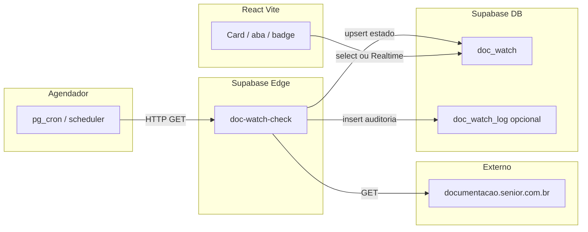

# Esboço — monitor de atualização da documentação Senior

Objetivo: a aplicação (aba, card ou botão) refletir quando o conteúdo relevante dessas URLs mudar no servidor da Senior.

- [Gestão Empresarial ERP — notas 5.10.4](https://documentacao.senior.com.br/gestaoempresarialerp/notasdaversao/#5-10-4.htm)
- [Documentos Eletrônicos — notas 5.8.16](https://documentacao.senior.com.br/documentoseletronicos/notasdaversao/#5-8-16.htm)

> **Importante:** não existe callback oficial da Senior para o seu app. A detecção é **heurística** (hash do HTML ou ETag), com a granularidade do **cron** (ex.: 1× ao dia). Mudanças só no *hash* da URL (âncora `#...`) não geram novo request ao servidor — o que importa é o **documento HTML** retornado pelo `GET` da URL base ou da página servida.

---

## 1. Visão geral

Mesmo padrão já usado no projeto: **Edge Function** + **tabelas** + **cron** (ver `KEEPALIVE_SETUP.md` e `supabase/functions/keepalive-check`).

---

## 2. Modelo de dados

### 2.1 Tabela `doc_watch` (estado atual por URL)

| Coluna | Tipo | Descrição |
|--------|------|-----------|
| `id` | `uuid` PK | Opcional; pode usar `url` como PK. |
| `url` | `text` UNIQUE NOT NULL | URL exata que o job consulta. |
| `titulo` | `text` | Nome amigável para o UI (ex.: "ERP 5.10.4"). |
| `content_hash` | `text` | SHA-256 de um recorte normalizado do corpo (ou string vazia até 1ª leitura). |
| `etag` | `text` nullable | Se o servidor enviar `ETag`, guardar para comparar antes do hash. |
| `last_modified` | `text` nullable | Cabeçalho `Last-Modified`, se existir. |
| `ultima_verificacao_em` | `timestamptz` | Último run do job para esta URL. |
| `ultima_mudanca_detectada_em` | `timestamptz` nullable | Quando o hash/etag mudou pela última vez. |
| `mudanca_nao_lida` | `boolean` default `false` | **Sinal para o UI** — usuário ou processo pode marcar como lida. |

**RLS (espelhar `configuracoes` / `keepalive_log`):**

- `authenticated`: `SELECT` em `doc_watch` (leitura para montar card/aba).
- Opcional: `UPDATE` apenas em `mudanca_nao_lida` para o usuário “marcar como visto”.
- Inserção/atualização das colunas técnicas só pela **service role** na Edge Function (política `insert`/`update` com `service_role` ou sem política de update para `authenticated` nas colunas sensíveis — o mais simples é só **service role** gravar tudo e o app só **ler**).

### 2.2 Tabela opcional `doc_watch_log` (auditoria)

Igual filosofia do `keepalive_log`: uma linha por execução por URL com `verificado_em`, `hash_anterior`, `hash_novo`, `mudanca_detectada boolean`.

---

## 3. Edge Function `doc-watch-check`

**Local sugerido:** `supabase/functions/doc-watch-check/index.ts`

**Fluxo:**

1. Validar método `GET` ou `POST` (como `keepalive-check`).
2. Instanciar `createClient(SUPABASE_URL, SUPABASE_SERVICE_ROLE_KEY)`.
3. Carregar linhas de `doc_watch` (ou usar lista fixa no código na primeira versão).
4. Para cada `url`:
   - `fetch(url, { headers: { 'User-Agent': 'SeuApp/1.0 (doc-watch; +contato)' } })`.
   - Se `response.ok`, ler `response.headers.get('etag')`, `last-modified`.
   - Corpo: `const text = await response.text()`.
   - **Normalizar** antes do hash (reduzir falsos positivos):
     - Remover blocos muito voláteis se identificáveis (timestamps embutidos, ids de sessão) — opcional e arriscado; na v1 pode ser só `text` inteiro.
   - `hash = sha256(normalized)` — em Deno usar `crypto.subtle.digest` com `TextEncoder`.
   - Buscar registro atual no banco:
     - Se `etag` mudou **ou** `hash` mudou em relação a `content_hash`: atualizar `content_hash`, `etag`, `last_modified`, `ultima_mudanca_detectada_em = now()`, `mudanca_nao_lida = true`.
     - Senão: só atualizar `ultima_verificacao_em` e cabeçalhos cache.
5. Responder JSON `{ ok: true, urls: [...] }` com resumo por URL.

**Deploy:** `supabase functions deploy doc-watch-check --no-verify-jwt` (se o cron usar anon key como no keepalive).

**Segredos:** nenhum obrigatório além dos já injetados; opcional `DOC_WATCH_USER_AGENT` se quiser configurável.

---

## 4. Agendamento (cron)

No Supabase, repetir o padrão documentado em `KEEPALIVE_SETUP.md` / comentários em `supabase.sql`:

- `cron.schedule` chamando `net.http_post` (ou GET) para  
  `https://<PROJECT>.supabase.co/functions/v1/doc-watch-check`  
  com `Authorization: Bearer <anon_key>`.

Frequência sugerida: **1× ao dia** (menos chance de bloqueio por volume; notas de versão não mudam a cada hora).

---

## 5. Frontend (React)

**Leitura:**

- Após login: `supabase.from('doc_watch').select('*').order('titulo')`.
- Exibir badge “Novo” quando `mudanca_nao_lida === true`.

**Atualização em tempo quase real (opcional):**

- `supabase.channel('doc_watch').on('postgres_changes', { event: '*', schema: 'public', table: 'doc_watch' }, callback).subscribe()`
- Habilitar **Realtime** para a tabela `doc_watch` no dashboard do Supabase.

**Sem Realtime:**

- `refetchInterval` (ex.: 5 min) no mesmo `select`, ou só ao focar na janela (`visibilitychange`).

**Marcar como lido:**

- Botão “Marcar como visto” → `update doc_watch set mudanca_nao_lida = false where id = ...`  
  (requer política RLS de `UPDATE` só para essa coluna, ou RPC `security definer`).

---

## 6. Seeds iniciais

Inserir duas linhas em `doc_watch` (via SQL no `supabase.sql` ou painel) com as URLs completas e `titulo` legível. Na primeira execução da função, o hash é gravado e **não** deve disparar “novo” (definir regra: só `mudanca_nao_lida = true` quando **já existia** `content_hash` anterior e diferente do novo).

---

## 7. Riscos e mitigação

| Risco | Mitigação |
|-------|-----------|
| HTML com banner/hora que muda sempre | Preferir ETag se estável; ou extrair só região principal com regex frágil — documentar trade-off. |
| Bloqueio 403 por bot | User-Agent honesto; frequência baixa; não paralelizar agressivamente. |
| Site fora do ar | Tratar `!ok`, logar em `doc_watch_log`, não apagar hash antigo. |
| Falso “novo” na primeira instalação | Só setar `mudanca_nao_lida` quando houver hash anterior não vazio. |

---

## 8. Ordem de implementação sugerida

1. SQL: criar `doc_watch` (+ opcional `doc_watch_log`) e RLS em `supabase.sql` (bloco comentado “DOC WATCH” para quem já tem banco).
2. Edge Function `doc-watch-check` + deploy.
3. Cron no painel / `pg_cron`.
4. Seed das duas URLs.
5. UI: componente pequeno (card na Home ou link na Navbar) + opcional Realtime.

Quando for implementar, alinhar nomes de tabela/colunas ao estilo existente (`criado_em`, `snake_case`, políticas nomeadas em português como no restante do `supabase.sql`).
